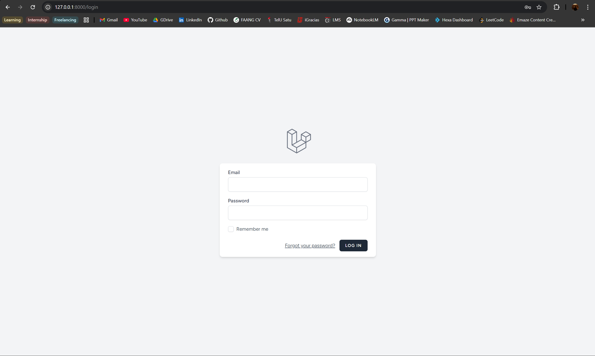
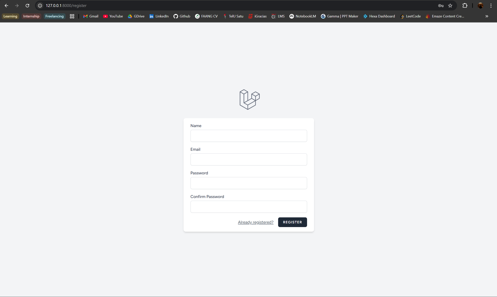
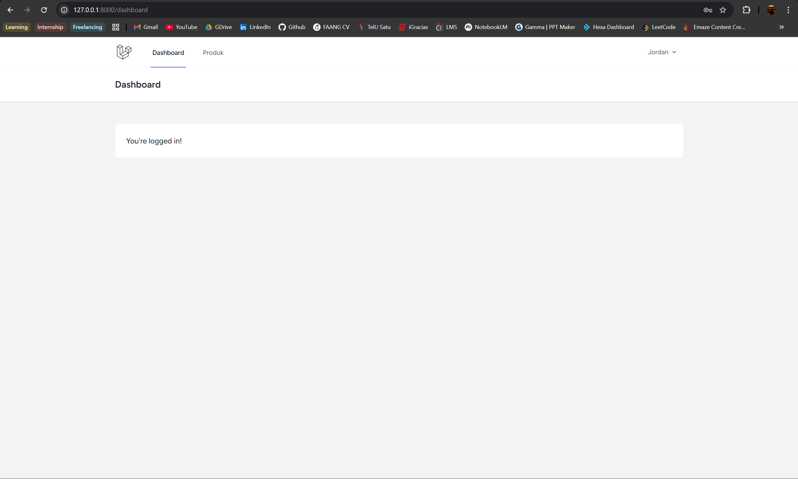
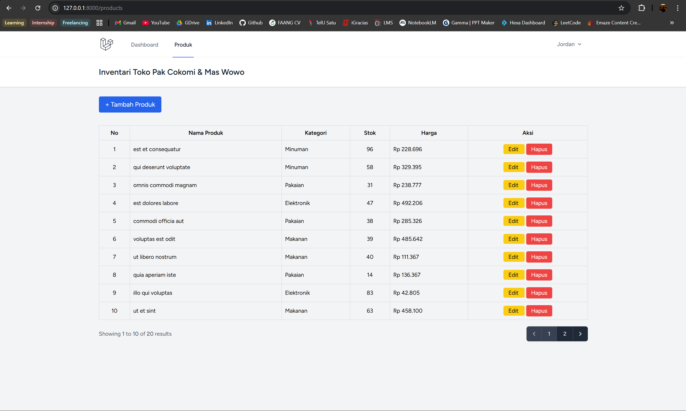
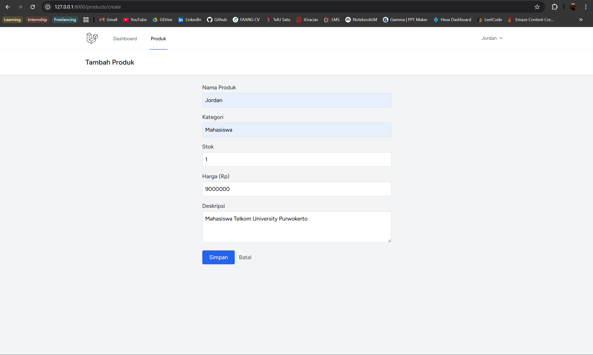
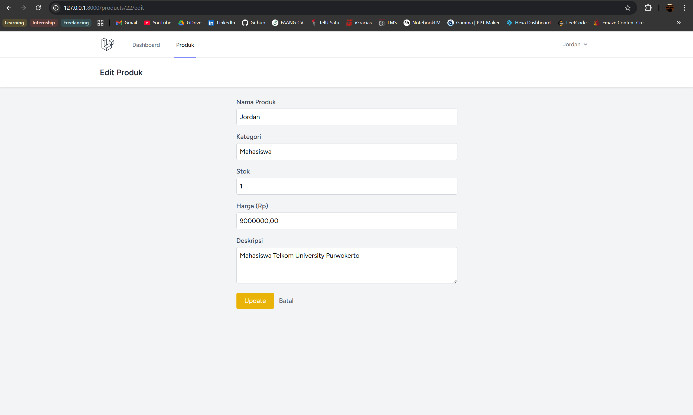
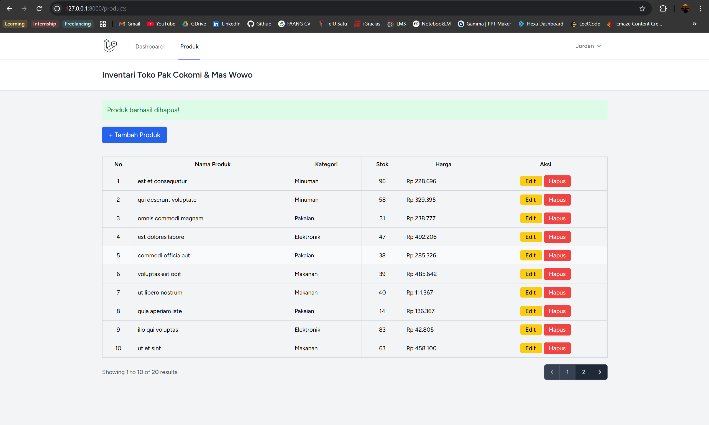
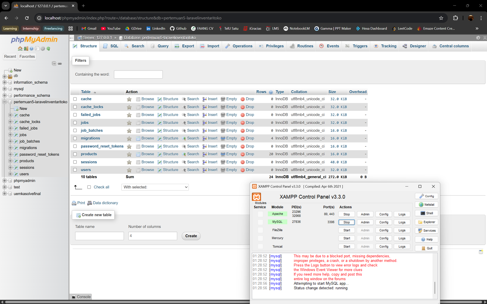
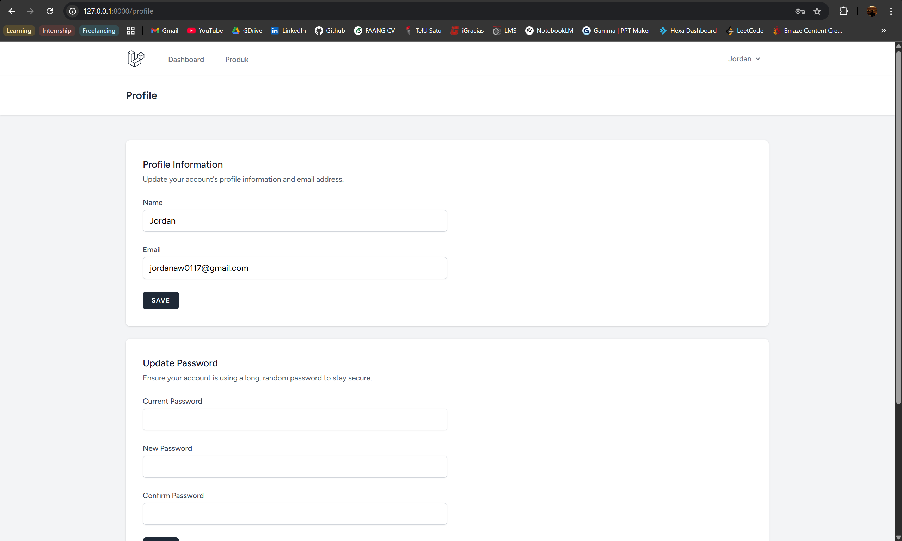

# Inventari Toko Pak Cokomi & Mas Wowo

Aplikasi web inventari toko berbasis Laravel dengan fitur manajemen produk lengkap.

## Fitur
- Autentikasi pengguna (Laravel Breeze)
- CRUD produk (Create, Read, Update, Delete)
- Data table dengan pagination
- Konfirmasi modal sebelum hapus
- Database seeder & factory (20 data dummy)

## Teknologi
- Laravel 11
- Laravel Breeze (Blade)
- MySQL
- Tailwind CSS

## Cara Menjalankan

### 1. Clone repository
git clone https://github.com/USERNAME/inventari-toko.git
cd inventari-toko

### 2. Install dependencies
composer install
npm install

### 3. Setup environment
cp .env.example .env
php artisan key:generate

### 4. Konfigurasi database di .env
DB_DATABASE=inventari_toko
DB_USERNAME=root
DB_PASSWORD=

### 5. Jalankan migrasi dan seeder
php artisan migrate --seed

### 6. Build assets
npm run build

### 7. Jalankan server
php artisan serve

Buka http://localhost:8000

## Screenshot
### Login

### Register

### Dashboard

### Halaman Produk

### Tambah Produk

### Edit Produk

### Hapus Produk

### Database

### Profile

## Dibuat oleh
Nama: Jordan Angkawijaya
NIM: 2311102139
